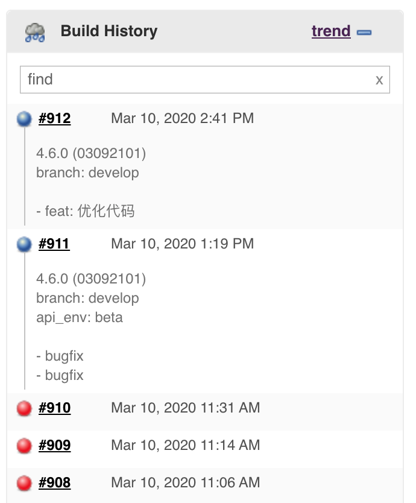

# update_jenkins_build plugin

[](https://rubygems.org/gems/fastlane-plugin-update_jenkins_build)

## Getting Started

This project is a [_fastlane_](https://github.com/fastlane/fastlane) plugin. To get started with `fastlane-plugin-update_jenkins_build`, add it to your project by running:

```bash
fastlane add_plugin update_jenkins_build
```



### Configure Jenkins

⚠️ **READ ME FRIST**

Jenkins version below 2.221, you need disable CSRF Protection in Global Security Settings page or
else you must append '-Dhudson.security.csrf.GlobalCrumbIssuerConfiguration.DISABLE_CSRF_PROTECTION=true' into Jenkins startup argument, [Check more details](https://github.com/icyleaf/fastlane-plugin-update_jenkins_build/issues/2).

## About update_jenkins_build

Update build's description of jenkins.

```
$ bundle exec fastlane action update_jenkins_build
+--------------+---------------------------------------------+-----------------------------------+---------+
|                                       update_jenkins_build Options                                       |
+--------------+---------------------------------------------+-----------------------------------+---------+
| Key          | Description                                 | Env Var                           | Default |
+--------------+---------------------------------------------+-----------------------------------+---------+
| description  | the description of current build            | UPDATE_JENKINS_BUILD_DESCRIPTION  |         |
| url          | the url of jenkins                          | UPDATE_JENKINS_BUILD_URL          |         |
| project      | the name of project(job)                    | UPDATE_JENKINS_BUILD_PROJECT      |         |
| build_number | the build number of project(job)            | UPDATE_JENKINS_BUILD_BUILD_NUMBER |         |
| user         | the user of jenkins if enabled security     | UPDATE_JENKINS_BUILD_USER         |         |
| password     | the password of jenkins if enabled security | UPDATE_JENKINS_BUILD_PASSWORD     |         |
+--------------+---------------------------------------------+-----------------------------------+---------+

+-----------------------------------+
| update_jenkins_build Return Value |
+-----------------------------------+
| [ture/false, response_body]       |
+-----------------------------------+
```

## Example

Check out the [example `Fastfile`](fastlane/Fastfile) to see how to use this plugin. Try it by cloning the repo, running `fastlane install_plugins` and `bundle exec fastlane test`.

Useful with fastlane plugin:

- [app_info](https://github.com/icyleaf/fastlane-plugin-app_info) to set version.
- [ci_changelog](https://github.com/icyleaf/fastlane-plugin-ci_changelog/) to update changelogs.

## Run tests for this plugin

To run both the tests, and code style validation, run

```
rake
```

To automatically fix many of the styling issues, use
```
rubocop -a
```

## Issues and Feedback

For any other issues and feedback about this plugin, please submit it to this repository.

## Troubleshooting

If you have trouble using plugins, check out the [Plugins Troubleshooting](https://docs.fastlane.tools/plugins/plugins-troubleshooting/) guide.

## Using _fastlane_ Plugins

For more information about how the `fastlane` plugin system works, check out the [Plugins documentation](https://docs.fastlane.tools/plugins/create-plugin/).

## About _fastlane_

_fastlane_ is the easiest way to automate beta deployments and releases for your iOS and Android apps. To learn more, check out [fastlane.tools](https://fastlane.tools).
